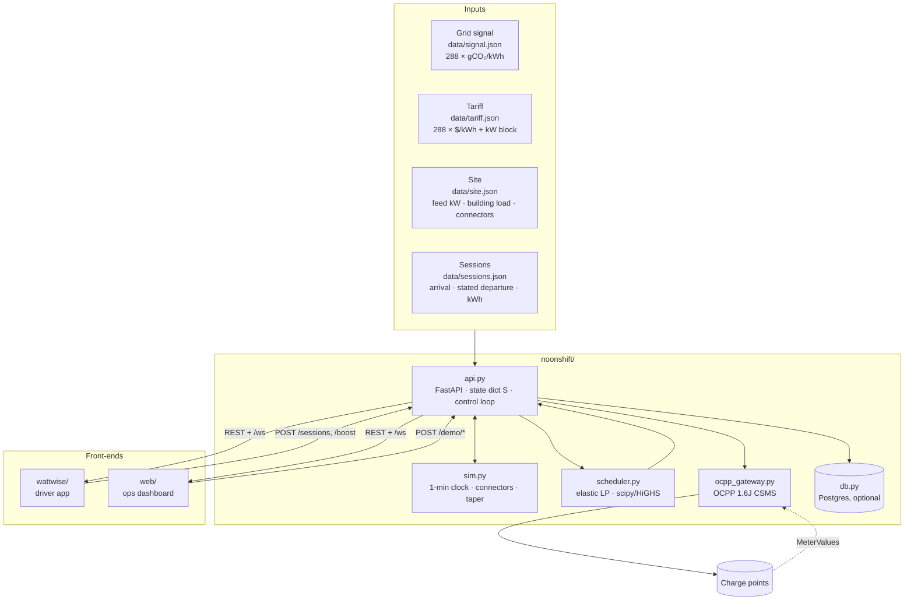
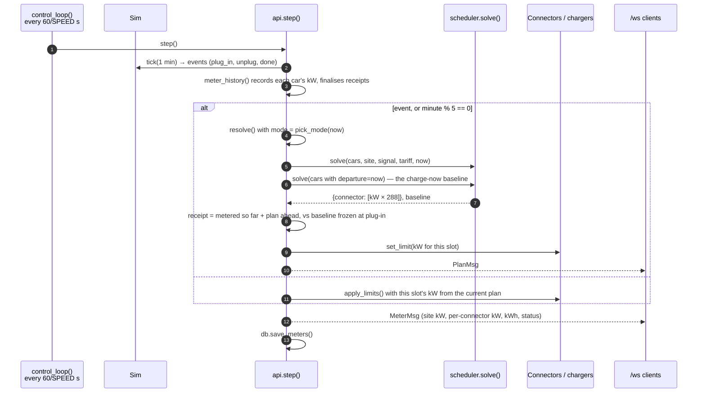
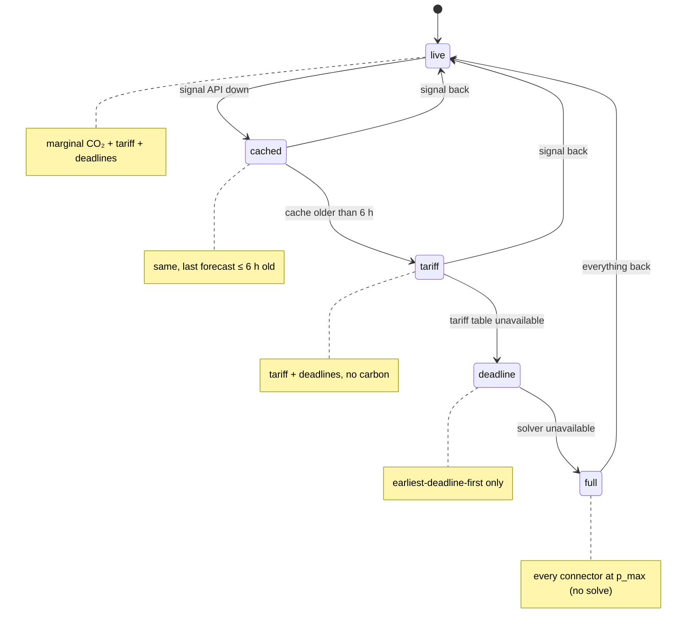
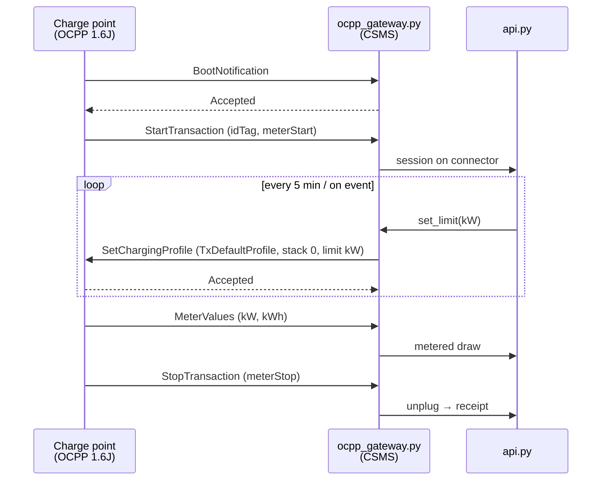
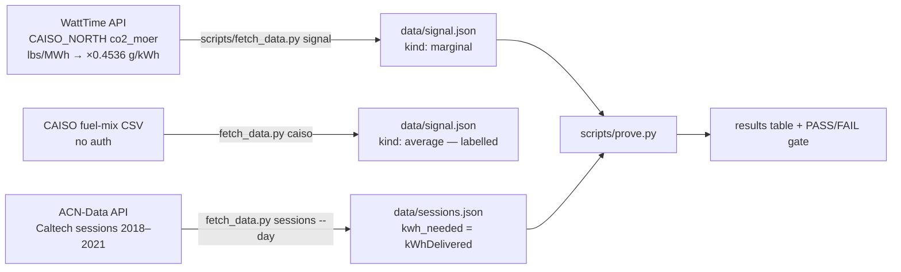

# Architecture

How Noonshift works, from a driver plugging in to a charger changing its current. Everything here is what the code on `main` does today; where a piece is planned rather than built, it says so.

Diagrams are Mermaid — GitHub renders them inline.

---

## 1. The pieces



| File | Role |
|---|---|
| `noonshift/scheduler.py` | `solve()` — the LP. `impact()` — receipt arithmetic. `price()` — tier lookup. Module constants at the top with their units and reasons. |
| `noonshift/api.py` | FastAPI app; the global state dict `S`; `step()` once per sim-minute; `resolve()` builds inputs, solves, pushes limits, broadcasts; `pick_mode()` is the fail-safe ladder; `/demo/*` scenario triggers. |
| `noonshift/sim.py` | `Sim` plays the day one minute at a time; `Connector` draws `min(limit, taper)`; `load_sessions()` reads `data/sessions.json`. |
| `noonshift/ocpp_gateway.py` | The CSMS side (`OcppConnector.set_limit` → `SetChargingProfile`) plus a fake charge point for the self-check. Enabled with `OCPP=1`. |
| `noonshift/models.py` | Pydantic bodies for REST and the three WebSocket frames — the contract with both front-ends. Regenerated into `docs/openapi.json` and `docs/ws-frames.json` on start. |
| `noonshift/db.py` | asyncpg writes for plans, sessions, meters; no-ops when `DATABASE_URL` is unset. |

---

## 2. The five-minute control loop



Two solves per cycle: the plan, and a **baseline** where every deadline is "now" (all cars ASAP). The receipt is the difference, and the baseline is **frozen at plug-in** per session — otherwise a rolling re-solve would shrink every receipt to zero by the time the driver unplugs.

---

## 3. The scheduler (LP)

Variables: `p[i,t]` = kW for car *i* in 5-min slot *t* (288 slots), `s[i]` = shortfall kWh, `over` = site kW above the tariff block, `z` = worst shortfall fraction.

```
minimise  Σ p·SLOT_H·(price[t] + W_CARBON·moer[t]/1000)  +  M_SHORT·s[i]  +  overage·over  +  M_SHORT·mean(e_rem)·z
```

| # | Constraint | Why |
|---|---|---|
| 1 | **Energy by deadline** — `Σ_{t<d} p·SLOT_H + s[i] ≥ e_rem[i]` | Elastic: the LP is never infeasible; a shortfall is explicit, priced at `M_SHORT`, and reported |
| 2 | **Progress floor** — at every 30-min checkpoint *since arrival*, delivered + planned ≥ `ALPHA` × pro-rata | Early leavers are never stranded; anchored to arrival so a rolling re-solve cannot defer it forever |
| 3 | **Sprint buffer** — last 30 min before the deadline carry a `BUFFER_COST` surcharge | A feasible car finishes early; the buffer is spent only by cars that would otherwise fall short, or after a bad forecast |
| 4 | **Charger cap** — `0 ≤ p ≤ p_max_kw` (reduced above 80 % SoC by the taper model) | Hardware limit; the taper tail is reserved so the slow last 20 % does not spill past the deadline |
| 5 | **Site limit** — `Σ_i p[i,t] ≤ feed_kw − building_load[t]` | Never exceed the feed |
| — | **Block** — `Σ_i p[i,t] − over ≤ block_kw` | Tariff demand block; overage priced at `block_price × multiplier / 30` per day |
| — | **Cap** — `Σ p·SLOT_H ≤ e_rem` | Never plan more than the car can take |
| — | **Fairness** — `s[i]/e_rem[i] ≤ z` | Minimising the worst fraction spreads shortfall across cars instead of starving one |

Post-step: any allocation in `(0, MIN_KW)` rounds **up** to 1.4 kW (6 A, IEC 61851 — some EVs never resume after a pause); if that pushes a slot over the cap, the cars with the most slack give way first. Results round *down* to the milliwatt, never over a limit.

Size: ~11,500 variables for 40 cars; HiGHS solves in 40–60 ms on the pinned scipy 1.14 (`tests/test_perf.py` guards it).

ASAP cars (deadline passed, or Boost): slot cost is just an earliest-first tie-break, so they charge now. When *every* car is ASAP (the baseline call) the block-overage term is dropped — charge-immediately means exactly that.

```mermaid
gantt
    title What the plan looks like for three cars (illustrative)
    dateFormat HH:mm
    axisFormat %H:%M
    section MOER
    gas ≈ 450 g/kWh     :crit,   m1, 07:00, 09:30
    solar ≈ 0 g/kWh     :active, m2, 09:30, 14:30
    mixed               :        m3, 14:30, 17:30
    section Car A (leave 17:30, 12 kWh)
    floor 1.4 kW        :        a1, 08:30, 09:30
    full 7 kW           :active, a2, 09:30, 11:00
    section Car B (leave 12:00, 15 kWh, boost 10:40)
    plan 7 kW           :active, b1, 09:30, 10:40
    boost 7 kW          :crit,   b2, 10:40, 11:45
    section Car C (leave 10:00, 5 kWh)
    ASAP 7 kW           :crit,   c1, 08:45, 09:30
```



---

## 4. The fail-safe ladder



`pick_mode()` in `api.py` walks the rungs top-down and returns the first healthy one; `resolve()` shapes the LP inputs to match (tariff-only ⇒ empty `moer`; deadline-only ⇒ also empty `price_per_kwh`; full ⇒ no solve). The demo button `POST /demo/signal_outage` flips the rungs.

**Known gap:** the `full` rung sets every connector to `p_max` at once. With 40 deferred cars that is a 280 kW spike on a 100 kW block. The fix — a static "safe share" profile that lives on the charger underneath the dynamic one, so chargers revert to it on their own when the backend disappears — is specified in [`solutions.md`](solutions.md) §5 and is the next scheduler-side change.

---

## 5. OCPP



`OcppConnector` replaces the simulator's `Connector` when `OCPP=1`; `set_limit` only takes effect once the charge point accepts the profile (`python -m noonshift.ocpp_gateway` runs the round-trip self-check against a fake charge point). Hardware max current is configured on the charger itself; the profile can only lower it.

Not yet done: authentication on the websocket (OCPP security profile 1), two-profile stacking with expiry (§4 gap), a real charger. See [`SECURITY.md`](../SECURITY.md) and [`solutions.md`](solutions.md) §5, §13.

---

## 6. Data



Rules baked into the scripts: signal and sessions come from the same grid; `kwh_needed` is what the car actually took (ACN's `kWhRequested` is a median 1.47× too high); an `average` signal is labelled as such all the way to the receipt.

**Perfect-foresight caveat:** today `prove.py` and `resolve()` plan on the realised signal. A product plans on the morning forecast and is scored on the actual. The change — fetch the forecast as published, plan on it, score on actual — is [`solutions.md`](solutions.md) §6.

---

## 7. Contracts

- REST bodies and WS frames: `noonshift/models.py` → `docs/openapi.json`, `docs/ws-frames.json` (regenerated on start; CI fails if a diff is uncommitted).
- Scheduler: `solve(cars, site, signal, tariff, now) → {connector_id: [kW × 288]}`, `impact(...)`, `price(...)` — signatures frozen; extras are keyword-only.
- WS frames: `PlanMsg` (per-connector kW plan, site kW, mode, reason), `MeterMsg` (per-connector live kW, kWh, status), `EventMsg` (plug_in, unplug, done, boost, day_reset, …).

---

## 8. Tests

| File | What it pins down |
|---|---|
| `tests/test_scheduler.py` | each LP rule, the 6 A floor, the trim, ASAP semantics, HiGHS "Unknown" guard |
| `tests/test_impact.py` | energy-matched receipt arithmetic, average-signal labelling |
| `tests/test_perf.py` | 40- and 60-car solves under a second; trips if the scipy pin is lifted |
| `tests/test_day.py` | a full simulated day through `api.step()` plus the four demo scenarios, on a frozen fixture day |
| `scripts/smoke.py` | driver REST → `/ws` → ops, against a live server (CI) |
| `scripts/prove.py` | the headline number, gated |
