# Noonshift

## A deadline-based EV charging scheduler that moves charging into the hours the grid is clean and cheap

Prepared for the hackathon, 12 September 2026. Every number in this document comes from a cited source in Section 10. Diagrams labelled "illustrative" show a shape, not measured data. The working name is Noonshift, because the product moves charging toward noon.

### How this document flows

This document tells one story in order. The Abstract gives the whole story in one paragraph. The Introduction explains why the time of charging decides its carbon. The Problem Statement locates the mismatch and names its four root causes. The Proposed Solution describes the six parts that remove those causes. Section 5 proves the solution is optimal and adoptable today. Section 6 shows how the parts are wired, from the transformer in the car park to the driver's phone. Section 7 tests the design against five real deployments and studies. Section 8 places Noonshift beside every incumbent in one table. Section 9 states what the design does not do. Section 10 lists every source.

---

## 1. Abstract

Electric vehicles charge the moment a driver plugs in, and that moment falls in the evening when gas plants meet demand, while at noon California throws away 3.4 TWh of solar a year because nobody draws it [6]. The cause is not a dirty grid but a missing piece of information: nobody asks the driver when the car must be ready, so no operator dares to delay any charging. Noonshift fixes this at the one place cars already sit in daylight for eight hours, the workplace car park. At plug-in it asks a single pre-filled question, "When do you leave?", then a per-site optimiser decides every five minutes how much power each charger gets, so that charging lands in the cleanest and cheapest hours, the site never exceeds its power limit, and every car is full by its deadline. The driver receives one honest receipt: money and CO2 saved compared with charging immediately. The site owner pays, because the scheduler cuts the electricity bill from day one under tariffs such as PG&E's Business EV rate, which prices 09:00 to 14:00 as the cheapest window [12]. The system is pure software on standard OCPP chargers with free grid data, it solves its optimisation in under one second, and it fails safe to full-power charging. Five real-world case studies confirm that each part of the design already works somewhere, and Noonshift is the first product to combine them at a daytime multi-connector site.

---

## 2. Introduction

### 2.1 You cannot choose your electrons, but you can choose your hour

A charger draws from the whole grid at the instant it runs. The grid mixes solar, wind, hydro, nuclear, gas and coal into one supply, so no charger can pick the green share. The only lever a charging operator holds is when and how hard each connector draws. "Green charging" is therefore a timing claim: the operator moved a kilowatt-hour from a moment when adding load would have spun up a gas turbine to a moment when it would have absorbed solar that the grid was about to curtail. That reframing turns the product from a dashboard into a scheduler under constraints.

### 2.2 The clean hours and the charging hours do not overlap

The chart below shows the shape of a spring weekday on the California grid. Marginal carbon, which is the carbon of the next kilowatt-hour the grid must generate, drops at midday when solar floods the system and rises in the evening when gas plants take over the ramp [6]. Default charging starts at plug-in, which for a home car means 17:00 to 23:00, exactly on the evening ramp. Cars sit at work from 08:00 to 17:00, exactly across the clean window [18].

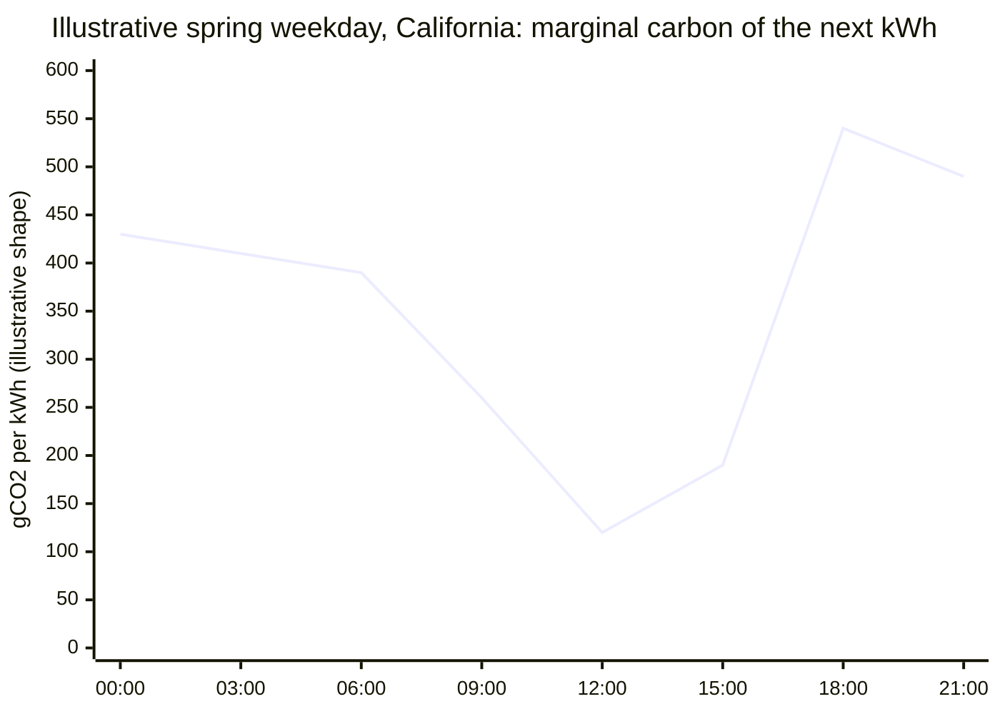

```
Hour     00:00   06:00   09:00          14:00   17:00        21:00   24:00
Grid     |-gas---|-gas---|==== solar ====|-mixed-|=== gas ramp ===|-gas-|
Cars     |-home--|-drive-|======== parked at work ========|-drive-|-home-|
Default  |charge |       |                                |charge-|charge|
```

The picture makes the whole thesis visible: the cars are already parked where the clean hours are, and nobody uses that fact. The next section explains why.

### 2.3 Four numbers that define the opportunity

```
+------------------+------------------+------------------+------------------+
|       72%        |      < 26%       |     3.4 TWh      |       85%        |
| of home sessions | of drivers ever  | of mostly solar  | of workplace     |
| start the moment | schedule, even   | power curtailed  | plug-in time is  |
| the plug goes in | on time-of-use   | in California in | idle flexibility |
| [1]              | tariffs [1]      | 2024, +29% [6]   | nobody uses [18] |
+------------------+------------------+------------------+------------------+
```

These four numbers lead directly to the problem statement.

---

## 3. Problem Statement

### 3.1 The brief

As EV adoption grows, charging stations draw power regardless of whether the grid runs on renewables or fossil fuels at that moment. The brief asks for a platform that helps charging network operators schedule and price sessions to align with high-renewable periods, and gives drivers real-time visibility into the greenness of their session, for three user groups: operators, drivers and grid operators.

### 3.2 Where the mismatch lives

The mismatch lives in four places at once, and each place has a measurable cause.

| Where | What goes wrong | Evidence |
|---|---|---|
| In time | Solar peaks 09:00 to 15:00, default charging starts 17:00 to 23:00 on the gas-fired evening ramp | CAISO keeps gas online for ramping, then curtails solar at noon [6] |
| In place | Managed-charging products live at home overnight; the sites with idle plugged-in hours during the solar window, workplaces and campuses, have none | Daytime charging beats home-overnight on storage, curtailment, ramping and emissions [2] |
| In the price signal | Retail off-peak windows date from an older grid; Octopus Intelligent Go's off-peak runs 23:30 to 05:30, so price and carbon disagree | PG&E's Business EV rate, with its 09:00 to 14:00 super-off-peak, is the exception that proves the rule [12] [22] |
| In the carbon signal | Displays show the average mix, but adding load moves the marginal generator; and when a fleet follows one signal, the signal breaks | Broadcast signals can raise emissions beyond roughly 1.5 million EVs [3] |

### 3.3 Four root causes

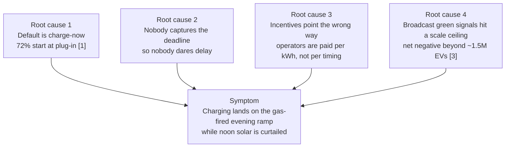

Root cause 1 rules out any product that needs the driver to change behaviour, because 72% never do [1]. Root cause 2 explains why operators charge everything immediately: without a deadline, delay means risk of stranding a driver, so nobody delays. Root cause 3 explains why workplace chargers have no reason to care: they bill energy, not timing. Root cause 4 explains why the incumbents' approach cannot simply scale: Martin, Powell and Rajagopal showed in December 2025 that managing charging with one broadcast marginal signal turns net negative beyond about 1.5 million EVs and should be avoided beyond about 500,000 [3].

### 3.4 The size of the waste

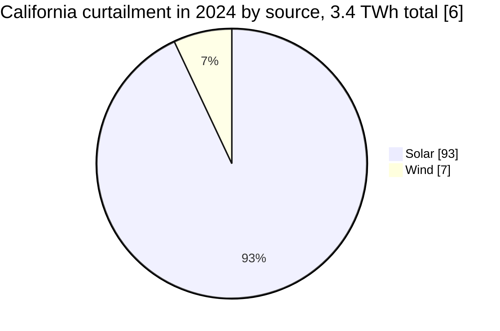

Batteries are absorbing part of this waste: curtailment fell from 13% to 11.5% of solar generation between January and May 2025, yet the absolute volume still grew by 4.1% [7]. At the same time, under forecast adoption, peak net demand in the Western Interconnection rises by up to 25%, and home-centred charging strains the grid while daytime charging relieves it [2].

### 3.5 The design brief that falls out

The four root causes give four requirements, and the solution in the next section answers each one.

1. Capture the deadline at plug-in with a zero-effort default (answers root causes 1 and 2).
2. Put the optimiser where the flexibility is: daytime, long-dwell, multi-connector sites (answers the "in place" mismatch).
3. Optimise centrally per site under the site's real power limit and never broadcast a signal for thousands of independent actors to chase (answers root cause 4).
4. Make the outcome visible and honest to the driver, and bankable to the site owner (answers root cause 3).

---

## 4. Proposed Solution

Noonshift is a scheduling layer on the charging operator's side plus a thin driver app. It sits between the charging management system and the chargers, speaks OCPP to the chargers, takes one input from the driver, and decides every five minutes how much power each connector receives.

### 4.1 The six parts

| Part | What it does | Which requirement it answers |
|---|---|---|
| A. Plug-in question | Asks "When do you leave?", pre-filled from the driver's history or read from the car over ISO 15118 where the car supports it [13]. Offers one optional toggle, "Need it sooner? Boost", at a premium. The default is the cheapest option. | Requirement 1 |
| B. Site scheduler | Solves a linear program every five minutes over the next 24 to 48 hours. Minimises forecast marginal CO2 and tariff cost, keeps the site inside its power limit and tariff block, guarantees each car's energy by its deadline, and never fails. | Requirements 2 and 3 |
| C. Anti-herding | Broadcasts nothing to drivers, because one site has one decision-maker. Across many sites, each plan adds to a shared committed-load curve that later sites see, so they spread across troughs. | Requirement 3 |
| D. Driver view | Shows the plan ("charging 11:10 to 12:20, ready by 17:30") and a live bar "grid is cleaner than X% of today". Ends with one receipt: "You saved $X and Y kg CO2 versus charging at plug-in", labelled as an estimate. | Requirement 4 |
| E. Operator dashboard | Shows site kW against limit and tariff block, a per-connector Gantt of planned versus actual, carbon and cost against the charge-immediately baseline, and deadline-risk alerts. | Requirement 4 |
| F. Grid interface | Publishes an aggregated shiftable-kW forecast per site, accepts OpenADR 3.0 demand-response events, and exposes OCPI 2.2.1 for roaming tariffs [14]. | Serves the grid operator user group |

### 4.2 One Tuesday for Priya, before and after

Priya drives to work, arrives at 08:30 and plugs in. Her car needs 8 kWh, which takes about 70 minutes at 7 kW. Forty colleagues do the same between 08:00 and 09:00. The site's electrical feed for the car park is 150 kW.

Without Noonshift, all 40 chargers start at once and demand 40 times 7 kW, which is 280 kW on a 150 kW feed. The breaker trips or the operator throttles everyone, and whatever does charge lands between 08:30 and 09:30, before the solar peak. Every car is full by 10:00 and sits idle for seven hours across the cleanest, cheapest window of the day.

With Noonshift, Priya's phone shows "Leaving at 17:30?" pre-filled from her past visits, and she taps once or ignores it. The scheduler now knows 40 cars, 8 kWh each, deadlines between 16:00 and 18:00, and a 150 kW cap. Forty cars times 8 kWh equals 320 kWh, and spread across the five-hour 09:00 to 14:00 window that is an average of 64 kW, well under the cap. The scheduler gives Priya 11:10 to 12:20, Ravi 11:40 to 12:50, and so on, keeping the total under 150 kW and inside the cheapest, cleanest hours. At 17:30 Priya unplugs a full car and reads one receipt.

```mermaid
gantt
    title One Tuesday at the 40-car lot, six cars shown, site limit 150 kW
    dateFormat HH:mm
    axisFormat %H:%M
    section Priya 17:30
    parked idle        :done, 08:30, 11:10
    charging 7 kW      :active, 11:10, 12:20
    parked idle        :done, 12:20, 17:30
    section Ravi 16:00
    parked idle        :done, 08:45, 11:40
    charging 7 kW      :active, 11:40, 12:50
    parked idle        :done, 12:50, 16:00
    section Mei 18:00
    parked idle        :done, 09:00, 12:20
    charging 7 kW      :active, 12:20, 13:30
    parked idle        :done, 13:30, 18:00
    section Arjun 17:00
    parked idle        :done, 08:20, 09:30
    charging 7 kW      :active, 09:30, 10:40
    parked idle        :done, 10:40, 17:00
    section Sofia Boost 10:30
    charging 7 kW      :crit, 09:10, 10:20
    parked idle        :done, 10:20, 10:30
    section Tom left early 13:00
    charging 3.5 kW    :active, 09:00, 11:20
    parked idle        :done, 11:20, 13:00
```

Sofia pressed Boost at 09:10 because of a 10:30 site visit, so she charged first and paid the premium. Tom told the app 17:00 but left at 13:00; the progress-floor rule had already delivered more than half his energy by then, so he left with a usable car and an honest receipt showing the shortfall.

### 4.3 The plug-in conversation

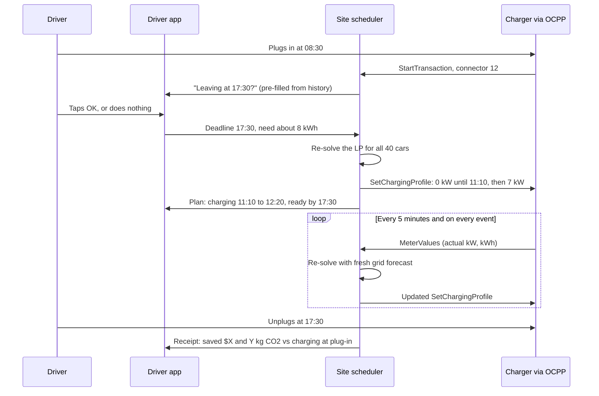

### 4.4 The scheduler in plain words

Time is cut into five-minute slots. For every plugged-in car and every slot, the optimiser picks a power level. It minimises one cost and obeys five rules.

```
MINIMISE  for every car i and slot t:
          power[i,t] x (carbon weight x marginal CO2[t]  +  cost weight x tariff[t])
        + penalty for exceeding the site's tariff kW block
        + very large penalty x any energy shortfall            (never fail, degrade gracefully)
        + small penalty x committed load of other sites[t]      (multi-site only, spreads troughs)

SUBJECT TO, for every car i:
  1. Energy by deadline   energy delivered + shortfall  >=  energy needed         (elastic)
  2. Progress floor       energy so far  >=  0.5 x pro-rata share at every moment  (fairness and early-unplug safety)
  3. Final sprint         full power for the last 30 minutes before the deadline while energy remains
  4. Charger limit        0  <=  power[i,t]  <=  max set on the charger by the operator
  and for every slot t:
  5. Site limit           sum of all car power  <=  site feed  minus  live building load
```

Forty connectors and 288 slots give about 11,500 variables, and the open-source HiGHS solver inside `scipy` finishes in well under one second. Re-solving every five minutes, and immediately on any plug-in, Boost or deadline edit, absorbs forecast error and battery taper. Because EVs cannot charge below 6 A, any allocation between 0 and 6 A rounds up to 6 A instead of pausing, since some EVs never resume after a pause.

The elastic shortfall term is why the solver never crashes: an oversubscribed lot has no exact solution, so the solver returns the best proportional plan and the affected drivers see a revised time and the Boost option. The progress floor is one constraint doing two jobs: it formalises fairness so no car starves, and it protects drivers who leave early.

### 4.5 Who pays

The site owner pays, because the scheduler pays for itself. PG&E's Business EV rate prices 09:00 to 14:00 as super-off-peak, 16:00 to 21:00 as peak, and bills by subscribed kW blocks instead of demand charges [12]. Under that tariff the carbon term and the cost term pull in the same direction, and staying inside the kW block is a real dollar saving. Utility managed-charging payments add a second income where they exist; Ava Community Energy already pays Optiwatt drivers $75 at enrolment plus up to $25 a year [21]. Drivers pay nothing extra by default, because green is the wrapper and not the price, and Boost is the only premium. A 2025 choice experiment found drivers value green electricity at about $0.06 per kWh but dislike long deferral windows, so a slower "green lane" loses while a deadline they already have costs them nothing [20].

The solution now exists on paper. The next section proves it is the right one and that it can be switched on today.

---

## 5. Why the Proposed Solution is Optimal and Feasible to Adopt in Today's World

### 5.1 Optimal for the driver: zero effort, zero cost, zero risk

Priya does one tap or nothing, and the default stands. This matters because 72% of drivers charge instantly and fewer than 26% ever schedule, so any product that needs the driver to act loses most drivers on day one [1]. She pays nothing extra, because the only premium is Boost, which she chooses. She takes no risk, because ready-by is a hard constraint with a progress floor and a final sprint, and if the backend dies the charger falls back to full power. She receives a counterfactual receipt, "saved $X and Y kg CO2 versus charging at plug-in", which is the only number that measures what the product did; a "62% renewable" badge would have been true if she had done nothing.

### 5.2 Optimal for the grid: the wedge is where the flexibility is

Powell, Cezar, Min, Azevedo and Rajagopal modelled the Western US grid under deep EV adoption and found that shifting charging to daytime reduces storage needs, excess renewable generation, ramping and emissions compared with home-overnight charging [2]. A workplace car dwells 8 to 10 hours and needs 7 to 10 kWh, which is about 1 to 1.5 hours of charging at 7 kW, so roughly 85% of the plugged-in time is unused flexibility [18]. The curtailment is midday [6]. The cars, the flexibility and the surplus all sit in the same five hours, and Noonshift is the only product placed there (Section 8).

### 5.3 Optimal by construction: one solver, one site, no stampede

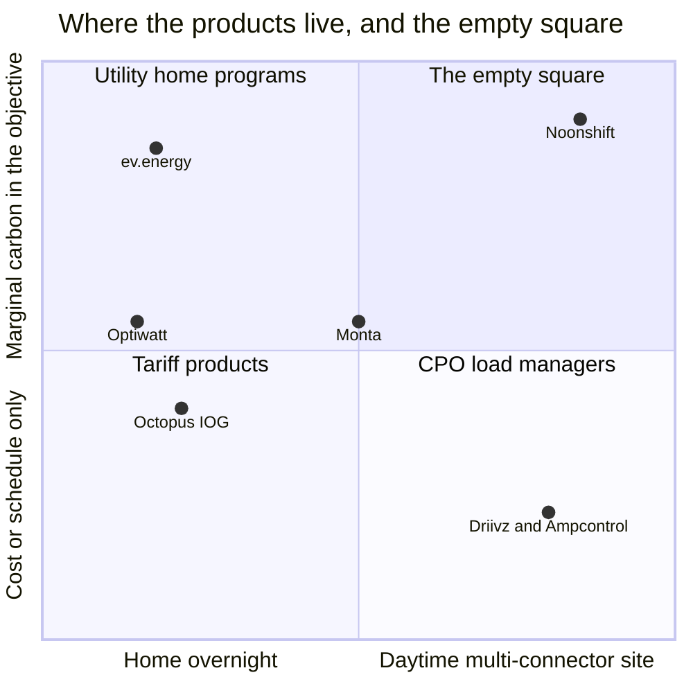

The word "optimal" is literal. The scheduler is a linear program, so for a given forecast it finds the best allocation, not a rule of thumb. Compare the obvious alternatives at the 40-car lot:

| Alternative | What goes wrong |
|---|---|
| Do nothing | 280 kW on a 150 kW feed; charging lands before the solar peak; noon solar is curtailed |
| A timer: "start at 11:00" | Everyone starts at once, the feed overloads again, and Sofia's 10:30 emergency has no path |
| Load balancing only (Driivz, Ampcontrol) | Stays under 150 kW but charges first-come-first-served and ignores carbon and deadlines |
| Home apps (ev.energy, Optiwatt, Octopus) | Right idea, wrong place: overnight on gas hours, one car at a time, one signal broadcast to every car |
| Noonshift | Deadline, carbon, cost and site limit solved together, per site, re-solved every five minutes |

The per-site design also answers the newest science. Martin, Powell and Rajagopal showed that one broadcast marginal signal turns net negative beyond about 1.5 million EVs, and that the fix is differentiated, group-wise signals [3]. Noonshift never broadcasts, because inside a site there is one actor; across sites, the committed-load term spreads plans across troughs. The carbon term can only move energy within Priya's deadline, so it can never make her late.

### 5.4 Feasible today: software on standard parts

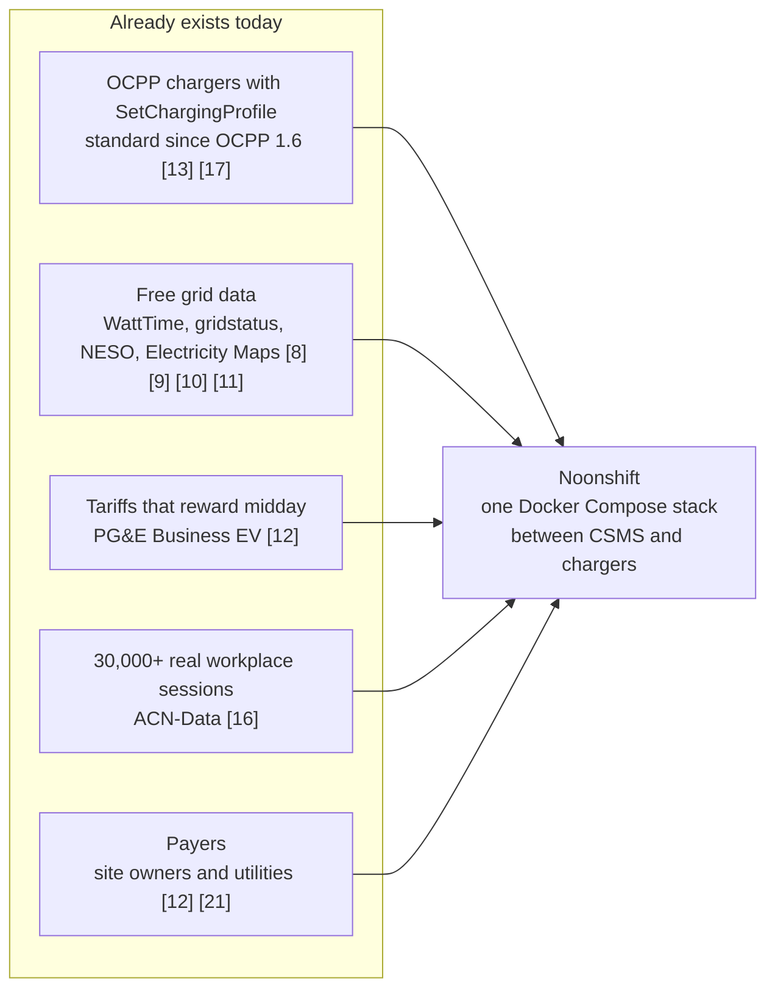

Nothing new has to exist. Commercial chargers already speak OCPP, and "charge at X kW" (`SetChargingProfile`) has been in the standard since OCPP 1.6, with OCPP 2.0.1 adding the car's own departure time and energy need [13]. Noonshift talks to the charger and not to the car maker, so any EV works, unlike telematics products that need an OEM API. Grid data is free for the demo region [8] [11]. A payer exists today, because PG&E's tariff already rewards 09:00 to 14:00 [12] and a utility already pays per vehicle for flexibility [21]. Rollout is one container between the charger software and the chargers, and fail-open means a pilot cannot make a site worse than it is today.

### 5.5 Feasible physically: plugged in is not charging

A car plugged in from 08:30 to 17:30 costs nothing, because the car is parked anyway and the plug is a cable in a parking bay. What is scarce is power, not plugs. A workplace AC charger costs a small fraction of a DC fast charger, so long-dwell charging is the cheap kind. Because Noonshift makes cars take turns, a site can install 40 chargers on a feed that serves only about 20 at full power, without buying a bigger transformer. Caltech built its Adaptive Charging Network for exactly this reason (Section 7.1). Section 6 shows the wiring that makes this true.

---

## 6. Tech Stack and System Architecture

### 6.1 The physical layer: one feed, many chargers

A commercial car park is one transformer feeding a distribution panel, and the panel feeds one charger per parking bay. Each charger can push about 7 kW single-phase or 22 kW three-phase, but the transformer caps the total. The building's own lifts, lights and air conditioning usually share the same transformer, so the scheduler reads the building meter live and gives the cars whatever is left.

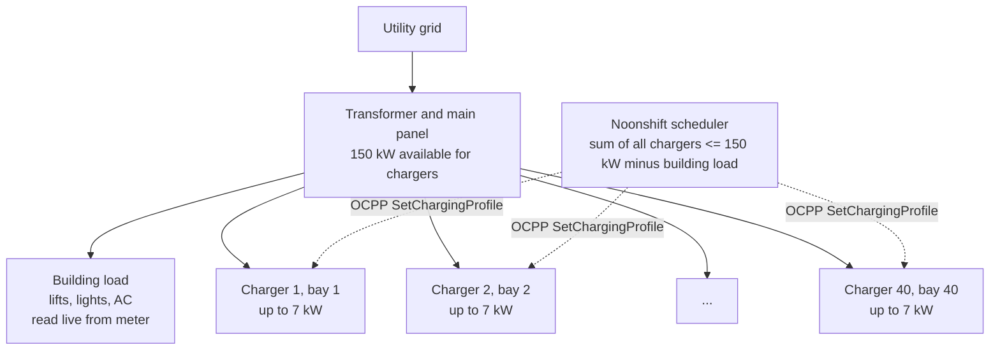

Forty chargers times 7 kW is 280 kW of demand on a 150 kW feed, so without control the site trips, installs half the chargers, or pays for a bigger transformer. With control, every bay gets a charger and the total never exceeds the feed.

### 6.2 Data flow

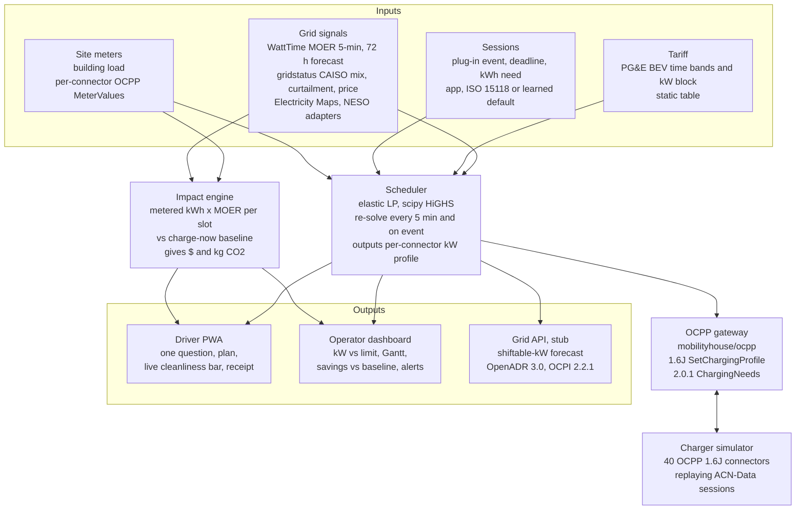

### 6.3 The five-minute control loop

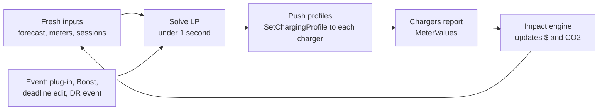

Re-planning instead of pre-planning is what makes battery taper harmless: when a car near full draws less than allocated, the next solve sees the measured kW and hands the slack to another connector.

### 6.4 The fail-safe ladder

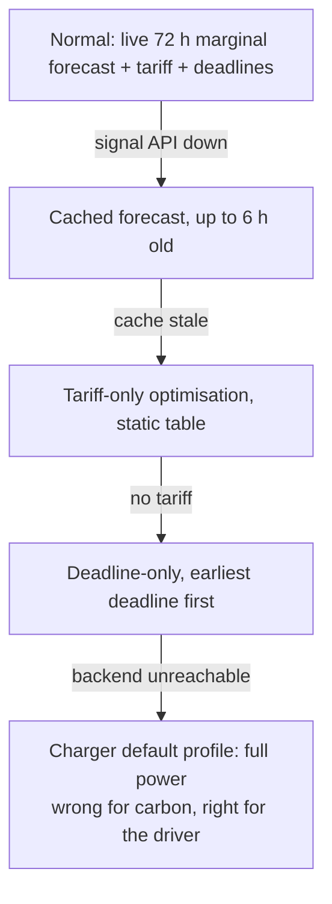

Hardware safety never enters the optimiser. The operator sets each connector's maximum current on the charger itself, and the LP can only choose within it, so a software bug can delay charging but can never exceed a hardware limit.

### 6.5 Stack

| Layer | Choice | Why |
|---|---|---|
| API | Python 3.12, FastAPI, WebSockets | Same language as the solver and the OCPP library, and REST matches the brief |
| Optimiser | `scipy.optimize.linprog` with HiGHS | Already a dependency; an 11,500-variable LP solves in under one second; no custom solver and no ML needed to ship |
| Charger protocol | `mobilityhouse/ocpp`, 1.6 and 2.0.1 [17] | Mature Python implementation that runs a CSMS and a fleet of simulated chargers in one process |
| Grid data | WattTime API Basic plan, gridstatus [8] [11] | Free for California; marginal signal, actual mix, curtailment and price; adapters for Electricity Maps, whose flow-traced average intensity follows the method in [5], and NESO [9] [10] |
| Sessions | ACN-Data via `acnportal` [16] | 30,000+ real workplace sessions with arrival, departure, kWh and user-stated departure |
| Storage | PostgreSQL, Redis | Time series of slots, plans and meter values; Redis pub/sub for live dashboards |
| Front end | React with Vite, PWA driver app | One code base; a PWA avoids app-store friction for a demo |
| Ops | Docker Compose | One command brings up API, database, simulator and front ends |

### 6.6 Key interfaces

```
POST /sessions                    {connector_id, departure_at, kwh_needed?}  -> plan, eta, price
POST /sessions/{id}/boost                                                    -> re-solve now, premium applied
GET  /sessions/{id}/live          -> {kw_now, grid_percentile, kwh_delivered, saved_usd, saved_kgco2}
GET  /sites/{id}/plan             -> per-connector 5-min kW profile, 24 to 48 h
GET  /sites/{id}/impact?from&to   -> kWh, $ and kg CO2 vs charge-immediately baseline
GET  /grid/flex-forecast          -> [{hour, shiftable_kw}]                  (stub)
POST /openadr/events              -> accept DR event, re-solve                (stub)
```

### 6.7 The 48-hour build order

```mermaid
gantt
    title 48-hour build, with the go or no-go gate at hour 6
    dateFormat H
    axisFormat %H h
    section Prove
    LP on real data, print bill and CO2 delta  :crit, 0, 6
    section Core
    FastAPI, Postgres, 40-connector OCPP simulator, scheduler loop :6, 16
    section Faces
    Operator dashboard and driver PWA :16, 30
    section Demo
    Early unplug, oversubscribed lot, signal outage scripts :30, 40
    section Ship
    Grid stubs, README, pitch :40, 48
```

The first six hours do not build UI. They run the LP on one day of ACN-Data sessions against PG&E rates and WattTime history and print the site's bill and CO2 delta versus charge-immediately. If that number is compelling, it is the pitch; if it is not, the team stops and rethinks.

The architecture is now complete. The next section checks each part against real deployments and peer-reviewed studies.

---

## 7. Five Case Studies

Each case study takes one real deployment or study, states what happened, and concludes what it proves for Noonshift. The timeline shows how the evidence accumulated.

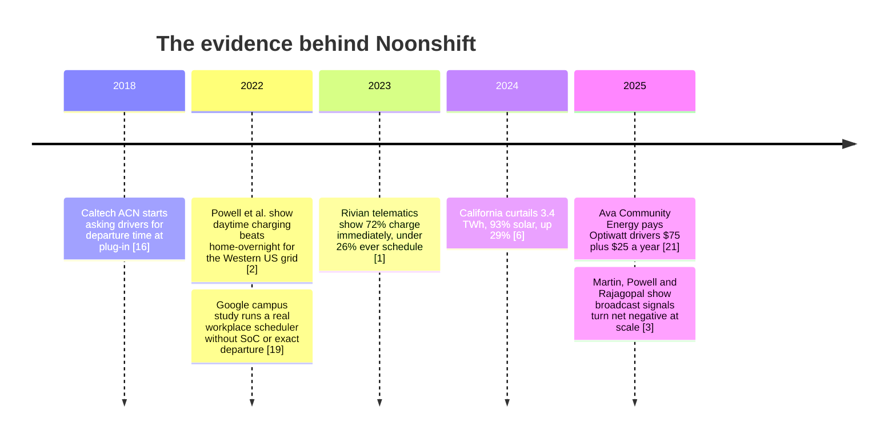

### 7.1 Case study 1: Caltech Adaptive Charging Network, the mechanism works at a real workplace

**Setting.** Caltech and NASA JPL run workplace car parks with adaptive charging networks and have published more than 30,000 real sessions as ACN-Data [16]. The network was built because the site wanted more chargers than its electrical infrastructure could serve at full power at once.

**What happened.** Since 2018, drivers at these sites have entered their estimated departure time and requested energy in a mobile app at plug-in, and the system has scheduled charging under the site's infrastructure limits. The sessions record arrival, departure, energy delivered and the driver's own inputs.

**What it proves.** Drivers do answer the deadline question at plug-in when the app asks once, so Part A of Noonshift has seven years of real-world precedent. Site-constrained scheduling across many connectors runs in production, so Part B is a proven mechanism. The open dataset gives Noonshift real sessions to test on, so the hour-6 gate in Section 6.7 uses measured behaviour, not synthetic data.

**What Noonshift adds.** ACN schedules for the site's infrastructure limit; Noonshift adds the marginal carbon signal, the tariff, the elastic guarantees and the counterfactual receipt on top of the same mechanism. The Google campus study confirms the guarantees are necessary: a real workplace scheduler had to operate without knowing the car's state of charge or exact departure, and driver trust collapses on the first stranded driver [19]. Noonshift therefore hard-codes the progress floor and the final sprint as constraints rather than hoping for good behaviour.

### 7.2 Case study 2: Rivian telematics, the zero-effort default is the only design that reaches drivers

**Setting.** Gupta, Vreeland, Peterman, Girouard and Wang analysed 2023 telematics from Rivian vehicles across the United States [1].

**What happened.** 72% of home charging sessions started immediately at plug-in, and fewer than 26% of sessions involved any deliberate scheduling, even for drivers on time-of-use tariffs that rewarded scheduling. The study estimated that automatic smart charging could save about $140 per driver per year and cut charging emissions by up to 28% without any behaviour change.

**What it proves.** Any product that needs the driver to choose a green option, set a schedule, or move a slider loses at least three quarters of drivers on day one. The only design that reaches the market is one where the default decides and the driver does nothing. Noonshift's single pre-filled question, with a learned conservative default when the driver ignores it, is that design.

**What Noonshift adds.** The Rivian study measured home charging, where the shift moves load from evening to overnight. Noonshift applies the same zero-effort principle at work, where the shift moves load into the solar window, which Case study 3 shows is the better destination.

### 7.3 Case study 3: the Western US grid, daytime workplace charging is the optimal destination

**Setting.** Powell, Cezar, Min, Azevedo and Rajagopal modelled the Western Interconnection under deep EV adoption in Nature Energy [2], and the US Energy Information Administration reported California's 2024 curtailment [6].

**What happened.** Peak net demand rose by up to 25% under forecast adoption and by 50% under full electrification when charging stayed home-centred. Shifting charging to daytime reduced the storage needed, the excess non-fossil generation curtailed, the ramping burden and the emissions. On the real grid, California curtailed 3.4 TWh in 2024, up 29% on the year, 93% of it solar, concentrated in spring middays, while gas stayed online through the day for the evening ramp.

**What it proves.** The best place to put flexible charging is daytime, and the place cars spend daytime is work, where they dwell 8 to 10 hours for 7 to 10 kWh of need [18]. The wedge Noonshift chose is the one the grid modelling recommends and the one the curtailment data rewards.

**What Noonshift adds.** The incumbents with a carbon signal all live at home overnight (Section 8), so none of them can reach the daytime surplus. Noonshift is placed where the surplus is.

### 7.4 Case study 4: ev.energy with WattTime, marginal signals work at scale and the broadcast ceiling is real

**Setting.** ev.energy runs utility managed-charging programmes for about 120,000 drivers using WattTime's marginal emissions signal, and WattTime's signal now steers more than one billion devices [8]. Martin, Powell and Rajagopal then tested what happens when a growing fleet follows such signals [3].

**What happened.** Real drivers accepted automatic carbon-aware charging at scale, with WattTime reporting up to 18% annual EV emissions reductions [8]. The December 2025 study found that plain marginal signals turn net negative beyond about 1.5 million EVs and that average signals can add up to 3.7% emissions, because a large fleet chasing one signal moves the marginal generator it was chasing. Cascading group-wise signals cut the added emissions by 10% to 28% at 2 million EVs, and the authors advise against plain broadcast signals beyond about 500,000 vehicles.

**What it proves.** The marginal signal is the right input, and drivers accept automation, so Noonshift's signal choice and driver model are validated by 120,000 real users. The broadcast architecture the incumbents use has a documented ceiling, so a product designed today must avoid it.

**What Noonshift adds.** Noonshift keeps the proven part, an automatic marginal-carbon objective, and removes the failing part, the broadcast. One site has one decision-maker, so nothing is broadcast, and across sites the committed-load term approximates the cascading method. The full method, which re-runs grid dispatch per cohort, needs a grid operator's model and stays on the roadmap.

### 7.5 Case study 5: Ava Community Energy with Optiwatt, and PG&E's tariff, someone pays for this today

**Setting.** Ava Community Energy, a California community choice aggregator, launched Ava SmartHome Charging with Optiwatt in May 2025 [21]. PG&E publishes its Business EV rate for commercial charging sites [12].

**What happened.** Ava pays each enrolled driver $75 at sign-up plus up to $25 a year for letting the programme shift charging, with a goal of 5,000 vehicles. PG&E's Business EV rate prices 09:00 to 14:00 as super-off-peak and 16:00 to 21:00 as peak, and bills by subscribed kW blocks instead of traditional demand charges.

**What it proves.** Flexibility has a buyer today. A utility values a shiftable vehicle at roughly $100 in the first year, and a commercial tariff already rewards exactly the window Noonshift targets while penalising the window it avoids. The site owner's bill falls from the day the scheduler is switched on, and staying inside the subscribed kW block is a second real saving.

**What Noonshift adds.** Ava and Optiwatt pay individual home drivers through OEM telematics. Noonshift monetises the same flexibility at a site, through the charger, for any car, with the site owner as the paying customer and the utility payment as a second income. The hour-6 demo prints the site's bill delta versus charge-immediately, which turns this case study into the sales pitch.

### 7.6 What the five case studies establish together

| Case study | Part of Noonshift it validates | Verdict |
|---|---|---|
| 1. Caltech ACN | Deadline capture at plug-in, site-constrained multi-connector scheduling, real test data | Mechanism proven in production since 2018 |
| 2. Rivian telematics | Zero-effort default as the only driver-feasible design | Behaviour-change products lose 72% or more on day one |
| 3. Western US grid and CAISO | Daytime workplace as the optimal placement | Grid modelling and curtailment data agree |
| 4. ev.energy and Martin et al. | Marginal signal as the objective, per-site design instead of broadcast | Signal proven with 120,000 drivers; broadcast ceiling documented |
| 5. Ava, Optiwatt and PG&E | Site owner as payer, utility payment as second income | Flexibility has a price today |

Each ingredient works somewhere today, and no product combines them at a daytime multi-connector site. The next section shows that gap product by product.

---

## 8. Market Research

### 8.1 Capability comparison

Cells reflect public product descriptions on 11 September 2026. "Partly" means the capability exists in a weaker or user-driven form.

| Capability | Noonshift | ev.energy | Optiwatt | WeaveGrid | Octopus IOG | Monta | Driivz / Ampcontrol | Tesla Charge on Solar |
|---|---|---|---|---|---|---|---|---|
| Daytime workplace or destination sites | Yes, the wedge | Home | Home | Home | Home | Partly | Depots | Home |
| Deadline captured at plug-in with zero-effort default | Yes | App schedule | App schedule | Utility-defined | App schedule | Settings | Fleet timetable | No |
| Marginal emissions in the objective | Yes | Yes | No | Utility-defined | Supplier grid | Average mix | No | No |
| Hard site power limit and tariff kW block | Yes | No | No | Distribution-level | No | Load balancing | Yes | No |
| Guaranteed ready-by (elastic, progress floor, sprint) | Yes, formal | Ready-by time | Ready-by time | Utility-defined | Ready-by time | Schedule | Departure-driven | No |
| Herding-aware (no broadcast, committed-load sharing) | By design | Broadcast | Broadcast | Broadcast | Broadcast | No | No | Not applicable |
| Driver sees counterfactual saving vs charge-now | Yes | Impact stats | Savings | No | Bill | CO2 shown | No | Solar share |
| Works with any EV (through the charger, no OEM API) | Yes | Telematics | Telematics | Telematics | Own tariff and charger | Own chargers | OCPP | Own ecosystem |
| Payer | Site owner | Utility | Utility | Utility | Supplier | Charger owner | Fleet or CPO | Home owner |
| Open protocols (OCPP profiles, OpenADR 3.0, OCPI) | OCPP now, others stubbed | Telematics | Telematics | Telematics | Own API | OCPP, OCPI | OCPP | Proprietary |

### 8.2 What each incumbent lacks, and why

| Product | What it does | What it lacks | Why it lacks it |
|---|---|---|---|
| ev.energy [8] | Utility managed-charging programmes for about 120,000 drivers, shifting home charging with WattTime's marginal signal | Home only, utility-territory-bound, one signal broadcast to every enrolled car | Utility demand-response budgets fund it, and those budgets target residential peaks |
| Optiwatt [21] | Consumer app and utility programmes through OEM telematics; Ava pays $75 plus $25 a year | Single-car optimisation, no site power constraint, depends on OEM API access | No charger is in the loop |
| WeaveGrid [23] | Utility-to-OEM orchestration including distribution constraints and vehicle-to-home | Not for public or workplace operators, no driver-facing greenness | It sells to utilities |
| Octopus Intelligent Go [22] | Tariff-led smart charging with a 23:30 to 05:30 off-peak and up to six hours scheduled "when greenest" | Overnight by design, supplier-locked | It is a retail tariff product |
| Monta SmartCharge [23] | Charge-point management with a user slider for cost, CO2 or renewable share | User must choose settings, average mix not marginal, no counterfactual, no herding awareness | Preference-driven user experience |
| Driivz and Ampcontrol [23] | Operator and depot energy management: dynamic load balancing, cost, on-site solar | Carbon secondary or absent, no driver-facing greenness, no deadline capture from public drivers | Sold on operating cost and uptime |
| Tesla Charge on Solar | Charges from the owner's rooftop surplus | Own roof only, ignores grid state | It is a home-energy feature |
| WattTime, Electricity Maps, NESO [8] [9] [10] | Signal providers with marginal or average carbon APIs | They are not schedulers; someone still decides who, how much, within what limit | They sell data |

### 8.3 The pattern

The incumbents split into three groups. Utility home programmes have the right signal at the wrong site. Operator cost optimisers have the right site with the wrong objective. Data providers have the right data with no control. The daytime multi-connector site optimised for carbon and for the site owner's bill is the empty square in the quadrant chart of Section 5.3, and Noonshift is the first product placed in it.

### 8.4 What is new and what is not claimed

Every individual ingredient exists somewhere; the combination, the placement and the honesty are the contribution. Three things are stated as "not found" rather than "does not exist". First, no product found combines deadline-elastic, marginal-carbon-aware, site-constrained allocation in one solver at a public or workplace site. Second, no incumbent has yet responded to the December 2025 finding that broadcast signals backfire, and Noonshift is herding-aware by architecture. Third, no incumbent shows the counterfactual receipt; they show renewable share, which would have been true had the driver done nothing.

Noonshift does not claim 100% renewable charging, because electrons are not attributable. It does not claim to solve grid-scale herding alone, because that needs an aggregator and a grid operator's dispatch model. It does not issue certificates, because the receipt is an estimate from a third-party marginal model. It does not shift DC fast charging, because a driver waiting thirty minutes has no flexibility to sell.

---

## 9. Limitations

Each limitation below is stated with what the design does about it.

1. **Impact numbers are estimates.** They depend on a third-party marginal emissions model, and marginal signals are noisy; a small change in demand can double the signal when the marginal unit flips from gas to coal [3]. Location-based versus market-based accounting can overstate savings by up to 55% [4]. Noonshift labels every number as an estimate with the method one tap away, and treats accredited hourly certificates [15] as a roadmap integration.

2. **One operator cannot fix grid-scale herding.** Noonshift avoids causing it and exposes the hooks; the full cascading method needs aggregators and grid operators to share dispatch models [3].

3. **Savings depend on the tariff.** Where off-peak is overnight and the site is a workplace, cost and carbon conflict; the carbon and cost weights make that trade-off explicit in the objective rather than hidden.

4. **Signal quality varies by region.** California and Great Britain have excellent data; many grids, including India's regional zones, have coarser or modelled data. The adapter pattern connects whatever exists and does not create data.

5. **More cars than chargers is not solved by the scheduler alone.** Noonshift assumes one charger per parked car for the whole dwell. When 80 drivers share 40 chargers, the deadline becomes "when must you move" and the scheduler charges within that shorter window, which keeps the guarantees but reduces the room to chase the cleanest hour. Sites handle the rotation with a move-by policy, and Noonshift shortens the deadline accordingly.

6. **The demo uses simulated chargers.** The simulator exchanges the same OCPP 1.6J messages a real charger does, and real hardware adds firmware quirks the team has not yet met.

7. **Adoption at real sites is unproven.** The zero-decision default is designed for the 72% who never schedule; whether site owners buy is the commercial question the hour-6 bill-delta demo answers.

8. **No bidirectional charging.** ISO 15118-20 and OCPP 2.1 are extension points, not features.

9. **Attribution is temporal, not physical.** Green charging means moving load to cleaner hours; it never means specific renewable electrons.

10. **Billing rules vary by jurisdiction.** Metering laws such as Germany's Eichrecht and California's CTEP require Boost and standard to be per-kWh rates that vary by time or option, not flat fees, and each jurisdiction needs its own check.

---

## 10. References

All references were opened and cross-checked on 11 September 2026. Nature pages redirect to a login wall for automated access, so the same papers were read through open mirrors (PubMed Central, OSTI). The MDPI Energies workplace study returned HTTP 403 and its figures come from the indexed abstract. The McKinsey premium figure is via a secondary source. Everything else was read directly.

1. Gupta, Vreeland, Peterman, Girouard, Wang (2025). *The Untapped Potential of Smart Charging: How EV Owners Can Save Money and Reduce Emissions Without Behavioral Change.* arXiv:2503.03167. Rivian 2023 telematics; 72% immediate start; under 26% deliberate scheduling; about $140 per year; up to 28% emissions cut. https://arxiv.org/abs/2503.03167
2. Powell, Cezar, Min, Azevedo, Rajagopal (2022). *Charging infrastructure access and operation to reduce the grid impacts of deep electric vehicle adoption.* Nature Energy 7, 932 to 945. https://www.nature.com/articles/s41560-022-01105-7 · open copy: https://www.osti.gov/pages/biblio/1987341
3. Martin, Powell, Rajagopal (2025). *Cascading marginal emissions signals for green charging with growing electric vehicle adoption.* Nature Communications 16. https://www.nature.com/articles/s41467-025-64979-7 · open copy: https://pmc.ncbi.nlm.nih.gov/articles/PMC12630845/
4. Maji, Bashir, Irwin, Shenoy, Sitaraman (2024). *The Green Mirage: Impact of Location- and Market-based Carbon Intensity Estimation on Carbon Optimization Efficacy.* arXiv:2402.03550. https://arxiv.org/abs/2402.03550
5. Tranberg et al. (2019). *Real-Time Carbon Accounting Method for the European Electricity Markets.* arXiv:1812.06679. https://arxiv.org/abs/1812.06679
6. U.S. Energy Information Administration, Today in Energy (2025). *Solar and wind power curtailments are increasing in California.* https://www.eia.gov/todayinenergy/detail.php?id=65364
7. pv magazine USA (22 July 2025). *California solar curtailment down 12% on back of batteries.* https://pv-magazine-usa.com/2025/07/22/california-solar-curtailment-down-12-on-back-of-batteries/ · CAISO Key Statistics, September 2025: https://www.caiso.com/documents/key-statistics-sep-2025.pdf
8. WattTime. ev.energy partnership: https://watttime.org/news-and-insights/watttime-and-ev-energy-expand-partnership-to-allow-ev-drivers-to-automatically-sync-charging-with-cleaner-electricity/ · one billion devices: https://watttime.org/news-and-insights/more-than-one-billion-smart-devices-now-using-marginal-emissions-data-to-slash-power-grid-pollution-with-watttimes-aer/ · data plans: https://watttime.org/docs-dev/data-plans/
9. Electricity Maps. Methodology: https://www.electricitymaps.com/data/methodology · 72-hour forecasts: https://www.electricitymaps.com/resources/updates/new-72-hour-grid-forecasts-advanced-load-optimization-for-greater-carbon-and-cost-savings · free tier limits: https://help.electricitymaps.com/en/articles/13335550-how-can-i-access-the-electricity-maps-api-and-are-there-any-restrictions
10. NESO Carbon Intensity API (Great Britain). https://carbonintensity.org.uk/
11. gridstatus (open source). https://github.com/gridstatus/gridstatus · curtailment example: https://opensource.gridstatus.io/en/0.23.0/Examples/caiso/Renewable%20Curtailment.html
12. PG&E Business EV rate plans. https://www.pge.com/en/account/rate-plans/electric-vehicles.html · CPUC overview: https://www.cpuc.ca.gov/industries-and-topics/electrical-energy/infrastructure/transportation-electrification/electricity-rates-and-cost-of-fueling
13. Open Charge Alliance. *What is new in OCPP 2.0.1.* https://openchargealliance.org/wp-content/uploads/2024/01/new_in_ocpp_201-v10.pdf · ChargingNeeds reference: https://pkg.go.dev/github.com/pxc-smart-business/ocpp-go/ocpp2.0.1/smartcharging
14. OCPI 2.2.1 guide: https://www.ampeco.com/guides/the-complete-ocpi-guide/ · OpenADR 3.0 with OCPP: https://www.openadr.org/assets/using%20openadr%20with%20ocpp.pdf
15. EnergyTag, first accredited Granular Certificate issuers (June 2025): https://energytag.org/energytag-accredits-first-granular-certificate-issuers-marking-a-major-milestone-for-hourly-clean-energy-tracking/ · Flexidao and Google, 10.5 TWh converted: https://www.flexidao.com/resources/google-portfolio-gc-conversion
16. Lee, Li, Low (2019). *ACN-Data: Analysis and Applications of an Open EV Charging Dataset.* ACM e-Energy. https://ev.caltech.edu/assets/pub/ACN_Data_Analysis_and_Applications.pdf · acnportal: https://github.com/zach401/acnportal
17. mobilityhouse/ocpp, Python OCPP 1.6 and 2.0.1. https://github.com/mobilityhouse/ocpp
18. Workplace charging statistics. *Evaluation of Electric Vehicle Charging Usage and Driver Activity*, World Electric Vehicle Journal 14(11):308, https://doi.org/10.3390/wevj14110308 · *Load Flexibilities from Charging Processes by EVs at the Workplace*, Energies 19(1):42, https://doi.org/10.3390/en19010042 (abstract only) · high-resolution workplace data: https://www.ncbi.nlm.nih.gov/pmc/articles/PMC8263557/
19. Tucker, Cezar, Alizadeh (2022). *Real-Time Electric Vehicle Smart Charging at Workplaces: A Real-World Case Study.* arXiv:2203.06847. https://arxiv.org/abs/2203.06847
20. Applied Energy (2025). *Consumer preferences and willingness to pay for EV charging.* https://www.sciencedirect.com/science/article/pii/S0306261925007111 · McKinsey summary via Flexecharge (secondary): https://flexecharge.com/blog/exploring-consumer-sentiment-on-electric-vehicle-charging---new-mckinsey-report
21. Ava Community Energy (8 May 2025). *Ava SmartHome Charging with Optiwatt.* https://avaenergy.org/news/ava-launches-ava-smarthome-charging/ · https://optiwatt.com/
22. Octopus Energy. *Intelligent Octopus Go.* https://octopus.energy/blog/intelligent-octopus-go-smarter-charging-for-a-greener-grid/
23. Monta SmartCharge: https://monta.com/en/features/smartcharge/ · Driivz: https://driivz.com/solutions/charge-point-operators/ · Ampcontrol: https://www.ampcontrol.io/post/iso-15118-and-ocpp-2-0-the-dream-team-for-smart-charging?lang=en · FlexCharging and WattTime: https://watttime.org/news-and-insights/flexcharging-integrates-watttimes-automated-emissions-reduction-aer-into-charging-software-allows-electric-vehicles-to-optimize-their-smart-charging-to-reduce-grid-emissions/ · WeaveGrid: https://www.weavegrid.com/news/ev-charging-incentives-and-savings

---

*Prepared for the hackathon ideation phase. Numbers are quoted from the cited sources; product comparisons reflect public descriptions on the research date and need a re-check before external use.*
