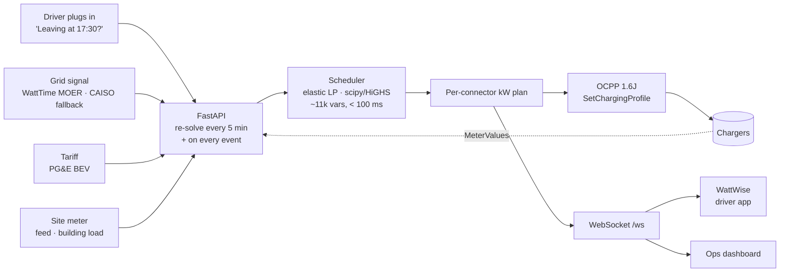

<div align="center">

# ☀️ Noonshift

**Deadline-based EV charging that moves charging into the hours the grid is clean and cheap — without ever missing a driver's ready-by time.**

[](https://github.com/Neal006/hackout2026/actions/workflows/ci.yml)
[](LICENSE)
[](https://www.python.org/)
[](https://openchargealliance.org/)
[](CONTRIBUTING.md)

Built at HACKOUT'26 · 12 September 2026 · [Docs](.docs/README.md) · [Architecture](.docs/ARCHITECTURE.md) · [Roadmap](.docs/ROADMAP.md) · [Contributing](CONTRIBUTING.md)

</div>

---

## The problem in one picture

EVs charge the moment a driver plugs in. At workplaces that is 07:00–09:00, when gas is still the marginal plant. Two hours later California is throwing away solar — **3.4 TWh a year** — because nobody draws it at noon. The cars are already parked where the clean hours are. Nobody uses that fact.

```mermaid
gantt
    title One workday: where the grid is clean vs. when cars charge today
    dateFormat HH:mm
    axisFormat %H:%M
    section Grid (marginal source)
    gas ramp            :crit,   g1, 06:00, 09:00
    solar (MOER ≈ 0)    :active, g2, 09:00, 15:00
    mixed               :        g3, 15:00, 17:00
    gas peak            :crit,   g4, 17:00, 21:00
    section Cars
    parked at work      :        c1, 08:00, 17:30
    charging today (plug-in)  :crit, c2, 08:00, 10:00
    charging with Noonshift   :active, c3, 09:30, 14:30
```



**72 %** of drivers charge the instant the plug goes in, and fewer than **26 %** ever schedule — even on tariffs built to reward it. Any solution that depends on drivers changing behaviour is dead on arrival. Noonshift asks one question and does the rest.

## What it does

1. **Asks one pre-filled question at plug-in** — *"Leaving at 17:30?"* — and works fine if the driver ignores it.
2. **Solves a linear program every 5 minutes** across every connector at the site: minimise marginal CO₂ and tariff cost, subject to the site's power limit and every driver's deadline.
3. **Never broadcasts a signal.** One solver per site, so it cannot cause the fleet-wide herding that broadcast carbon signals cause at scale.
4. **Shows an honest receipt** — $ and kg CO₂ saved vs. charging at plug-in, labelled *estimate*, method one tap away.
5. **Fails safe.** Live signal → cached → tariff-only → deadline-only → full power. Hardware limits live on the charger; software can delay charging, never exceed a limit.

## Results (real data, one day)

36 real workplace sessions (Caltech ACN, 2019-04-09) replayed against a real California marginal-emissions day (WattTime CAISO_NORTH, 2026-04-14). Same 378.9 kWh delivered both ways.

| | charge at plug-in | Noonshift | change |
|---|---|---|---|
| CO₂ | 23.0 kg | **7.1 kg** | **−69 %** |
| Bill (PG&E BEV-2-S) | $67.42 | $65.22 | −3.3 % |
| Peak | 101 kW | 100 kW | −1 % |
| Deadlines missed | — | **0** | |
| Solver fallbacks | — | **0** (530 solves, max 59 ms) | |

Cross-checks: July solar day −64 %; January gas day **−1.8 %** (nothing clean to shift to); same-year 2019 × 2019 average signal −54 %. The carbon story is real on solar days and near zero on gas days — we say both. Full numbers and caveats: [`.docs/metrics.md`](.docs/metrics.md).

> Sessions are from 2019, the grid signal from 2026, and the replay plans with the realised signal (perfect foresight). Both are stated on every slide; the fix for the second is in [`.docs/solutions.md`](.docs/solutions.md) §6.

## How it works



The scheduler is a linear program over 288 five-minute slots. Per car: energy by deadline (elastic — never infeasible, explicit shortfall instead), a progress floor so early leavers are never stranded, a 30-minute sprint buffer, the car's own power cap, and the site limit minus live building load. Details, constraints and the fail-safe ladder: [`.docs/ARCHITECTURE.md`](.docs/ARCHITECTURE.md).

## Quick start

```bash
git clone https://github.com/Neal006/hackout2026.git && cd hackout2026
python -m venv .venv && . .venv/bin/activate        # Windows: .venv\Scripts\activate
pip install -r requirements-dev.txt
python -m pytest                                    # 53 tests, ~1 min
python scripts/prove.py                             # the results table above, exits 0 on PASS
```

Run the whole thing:

```bash
# terminal 1 — backend (simulated day of 60 chargers; SIM_SPEED=480 plays a day in 3 minutes)
python -m uvicorn noonshift.api:app --port 8000 --reload
# terminal 2 — ops dashboard        # terminal 3 — driver app
cd web && npm ci && npm run dev     # cd wattwise && npm ci && npm run dev   → :5173 and :5174
```

Or everything in containers: `docker compose up -d --build` → backend `:8000`, ops `:3000`, driver app `:3001`.

| Env var | Default | Meaning |
|---|---|---|
| `SIM_SPEED` | `480` | sim-seconds per real second (`480` = one day in 3 min; `60` = real time) |
| `DATABASE_URL` | unset | Postgres DSN; unset → persistence is a no-op |
| `OCPP` | unset | `1` → drive `OcppConnector` instead of the simulator |
| `WATTTIME_USER` / `WATTTIME_PASSWORD` / `ACN_TOKEN` | unset | only for `scripts/fetch_data.py` |

> Seeing `[vite] http proxy error … ECONNREFUSED`? The backend on `:8000` is not running. Start terminal 1 first.

## Demo

Four buttons on the ops dashboard, each one a `POST /demo/*`:

| Beat | What you see |
|---|---|
| Normal day | 36 real sessions arrive 06:30–15:00; charging slides into the solar window, site load never crosses the limit |
| **Boost** | a driver taps "need it sooner"; the car jumps to full power at today's rate |
| **Early unplug** | a driver leaves before their stated time; the progress floor means they leave with a usable charge |
| **Oversubscribe** | +20 cars; the elastic LP spreads the shortfall fairly instead of failing |
| **Signal outage** | the grid API dies; the ladder steps down cached → tariff → full power, nobody is stranded |

Script for a 4-minute run: [`.docs/pitch/demo-script.md`](.docs/pitch/demo-script.md).

## API

Interactive docs at `http://localhost:8000/docs`. Contract files are committed and CI-checked: [`docs/openapi.json`](docs/openapi.json), [`docs/ws-frames.json`](docs/ws-frames.json).

```
POST /sessions                    {connector_id, departure_at, kwh_needed?}
POST /sessions/{id}/boost         charge now at today's rate
GET  /sessions/{id}/live          live kW, grid-cleanliness percentile, $ and kg saved so far
GET  /sites/{id}/plan             per-connector 5-min kW profile
GET  /sites/{id}/status           site kW vs feed vs block, ladder mode
GET  /sites/{id}/impact           kWh, $, kg CO₂ vs charge-immediately
GET  /grid/flex-forecast          shiftable load per hour (for the grid operator)
POST /openadr/events              demand-response event → less headroom in those slots
WS   /ws                          plan / meter / event frames
```

## Repository layout

```
noonshift/        scheduler.py (LP) · api.py (FastAPI, control loop, ladder) · sim.py · ocpp_gateway.py · db.py · models.py
scripts/          prove.py (results gate) · fetch_data.py (WattTime / ACN / CAISO) · smoke.py (end-to-end)
data/             one real day: signal.json · sessions.json · tariff.json · site.json
tests/            53 tests: scheduler, impact, performance, full-day replay
web/              ops dashboard (React + Vite)
wattwise/         driver app (React + TypeScript + Vite)
docs/             generated API contract (openapi.json, ws-frames.json)
.docs/            everything written by humans: architecture, roadmap, business model, metrics, pitch
```

## Documentation

| | |
|---|---|
| [`.docs/ARCHITECTURE.md`](.docs/ARCHITECTURE.md) | control loop, LP constraints, fail-safe ladder, OCPP, data flow — with diagrams |
| [`.docs/ROADMAP.md`](.docs/ROADMAP.md) | what exists, what is missing, in what order |
| [`.docs/business.md`](.docs/business.md) | break points, edge cases where we lose, pricing formula, 4-tier benefits |
| [`.docs/metrics.md`](.docs/metrics.md) | every metric we report and its formula |
| [`.docs/solutions.md`](.docs/solutions.md) | real-world fixes mapped to code locations |
| [`.docs/noonshift-proposal.md`](.docs/noonshift-proposal.md) | the full proposal, every figure cited |
| [`.docs/HOSTING.md`](.docs/HOSTING.md) | Render + Vercel, free tier |
| [`.docs/pitch/`](.docs/pitch/) | deck, demo script, hard questions |

## Contributing

Issues and PRs are welcome — see [CONTRIBUTING.md](CONTRIBUTING.md). Ground rules that matter here: every number in a doc cites a source that was actually opened; impact figures are estimates, never certificates; the scheduler's three public signatures (`solve`, `impact`, `price`) are frozen — add keyword-only extras. Security reports: [SECURITY.md](SECURITY.md).

## Acknowledgements

Caltech's [ACN-Data](https://ev.caltech.edu/dataset) for real workplace sessions · [WattTime](https://watttime.org) for marginal emissions · [mobilityhouse/ocpp](https://github.com/mobilityhouse/ocpp) · [HiGHS](https://highs.dev) via scipy.

## License

[MIT](LICENSE).
